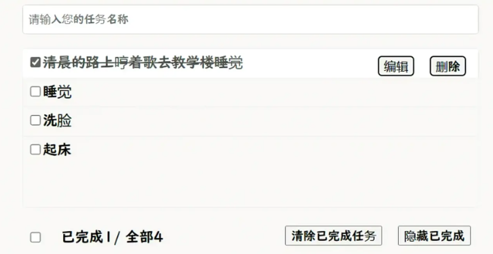

# Vue每日学习记录

## 0416 待办列表

请完成以下功能：

1. 列表的渲染，列表的数据是一个数组，数组里面是对象，对象的属性需要支持以下的功能。

2. 顶部有一个输入框，在输入框内输入任务名称后，回车将该事项添加到列表里面。注意是添加到顶部

3. 列表里面内容的左侧是一个checkbox，点击checkbox，将该事项的状态变成已完成。事项变成已完成后，需要将该事项的名字中加上删除线，并且checkbox的样式也要变成已完成的样式。

4. 鼠标浮在事项上，会出现一个删除按钮，点击删除按钮，将该事项从列表中删除。

5. 底部左侧有个checkbox，上面显示已完成数量，全部数量。同时点击该checkbox，将列表中所有的事项都变成已完成。

6. 底部右侧清除已完成任务按钮，点击该按钮，将列表中所有已完成的事项删除。

7. 底部右侧的隐藏已完成按钮，点击该按钮，将列表中所有已完成的事项隐藏。然后按钮变成显示已完成按钮，点击该按钮，将列表中所有已完成的事项显示出来。

8. 点击编辑按钮，支持对事项的编辑。